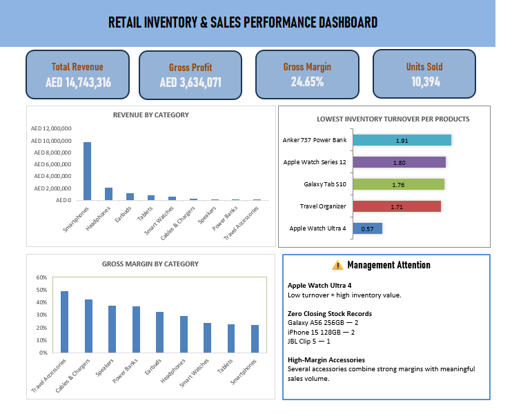

# Retail Inventory & Sales Performance Analysis

## Project Overview

This project analyzes retail inventory and sales performance for a consumer electronics and travel accessories business operating across multiple locations and sales channels.

The analysis focuses on identifying sales drivers, inventory efficiency, stock availability risks, location performance, and profitability to support better inventory and operational decisions.

## Dashboard Preview

## Business Problem

Management needs a clearer understanding of sales and inventory performance across products, categories, locations, and sales channels.

The objective is to identify products and inventory areas that require management attention and provide data-driven insights to support better inventory and operational decisions.

## Objectives

- Identify top-selling and slow-moving products.
- Evaluate inventory efficiency using inventory turnover.
- Identify potential stock availability risks.
- Compare sales performance across locations and channels.
- Analyze revenue, gross profit, and gross margin.
- Highlight products and categories that require management attention.

 ## Dataset

- **Records:** 1,800 cleaned records
- **Core fields:** 18
- **Business domain:** Consumer electronics and travel accessories
- **Sales channels:** Stores and online
- **Data includes:** Sales, inventory movements, product attributes, locations, suppliers, pricing, and lead times.

## Data Preparation

The dataset was reviewed and prepared before analysis to improve consistency and data quality.

Key preparation steps included:

- Removed 4 duplicate records.
- Standardized inconsistent category names.
- Standardized inconsistent location names.
- Reviewed missing values in supplier and lead-time fields.
- Validated inventory movement calculations.
- Calculated COGS and gross profit for profitability analysis.
- Calculated stock variance to identify inventory records requiring further validation.
- Retained the original closing stock as the source-of-record.

## Key Performance Indicators

The analysis used the following KPIs to evaluate sales, profitability, and inventory performance:

| KPI | Definition |
|---|---|
| Total Revenue | Total sales revenue generated |
| Gross Profit | Revenue minus Cost of Goods Sold (COGS) |
| Gross Margin | Gross Profit divided by Revenue |
| Units Sold | Total quantity of products sold |
| Average Inventory | Average of opening and closing inventory |
| Average Inventory Value | Average Inventory multiplied by Unit Cost |
| Inventory Turnover | COGS divided by Average Inventory Value |
| Zero Closing Stock | Records where closing stock reached zero |

## Analytical Methods

The analysis used Excel formulas, Pivot Tables, and dashboard visualizations to evaluate:

- Product sales performance and sales velocity.
- Revenue and profitability by product and category.
- Inventory efficiency and turnover.
- Potential stock availability risks.
- Sales performance across locations and channels.
- Products requiring management attention based on multiple KPIs.

## Business Recommendations

Based on the analysis, the following areas should receive management attention:

1. **Review low-turnover, high-value inventory**
   - Investigate products such as Apple Watch Ultra 4 to understand whether inventory levels, purchasing quantities, or product demand require adjustment.
   - Compare current turnover with historical or company-specific benchmarks before making inventory reduction decisions.

2. **Review zero-closing-stock events**
   - Investigate the five zero-closing-stock records identified across Galaxy A56 256GB, iPhone 15 128GB, and JBL Clip 5.
   - Review replenishment timing, lead times, and demand patterns to determine whether availability risk exists.

3. **Monitor product and category profitability**
   - Continue monitoring both absolute gross profit and gross margin.
   - High-margin accessories should be evaluated for opportunities to increase their contribution while maintaining healthy sales volume.

4. **Investigate location-level product mix**
   - Compare product mix and inventory availability across locations.
   - The difference between Abu Dhabi and Dubai performance suggests that product mix should be considered when evaluating location performance.

5. **Use multiple KPIs for inventory decisions**
   - Inventory decisions should consider sales volume, revenue, profitability, inventory value, turnover, and stock availability together rather than relying on a single metric.

## Project Files

| File | Description |
|---|---|
| [Cleaned Dataset](Data/retail_inventory_sales_cleaned.xlsx) | Cleaned retail inventory and sales dataset used for analysis |
| [Excel Dashboard](Dashboard/retail_inventory_sales_dashboard.xlsx) | Final Excel dashboard containing KPIs and analysis |
| [Data Dictionary](Documentation/retail_inventory_sales_data_dictionary.xlsx) | Definitions and descriptions of the dataset fields |
| [Data Cleaning Log](Documentation/retail_inventory_sales_cleaning_log.xlsx) | Documentation of data quality issues and preparation steps |
| [Dashboard Preview](Images/retail_inventory_sales_dashboard.png) | Preview image of the final dashboard |

## Tools & Skills

- Microsoft Excel
- Pivot Tables
- Excel formulas and calculated fields
- Inventory Analytics
- Sales Performance Analysis
- Profitability Analysis
- Data Cleaning & Validation
- KPI Development
- Business Analysis
- Dashboard Design
- Inventory Turnover Analysis

## Limitations

The analysis has several limitations that should be considered when interpreting the findings:

- The dataset does not contain transaction or basket IDs, so cross-selling relationships cannot be directly measured.
- Zero closing stock indicates a potential availability issue but does not confirm lost sales.
- Inventory turnover should be interpreted against company-specific or historical benchmarks.
- The dataset does not provide a direct measure of customer demand during stockout periods.
- Some supplier and lead-time fields contain missing values.
- The dataset represents a simulated retail environment and should not be interpreted as actual company performance.

## Conclusion

This project demonstrates an end-to-end approach to retail inventory and sales analysis, from data preparation and validation through KPI development, business analysis, and dashboard creation.

The analysis combines sales, profitability, inventory efficiency, stock availability, and location performance to identify areas requiring management attention.

The project also demonstrates how Excel can be used to transform operational retail data into actionable business insights.
